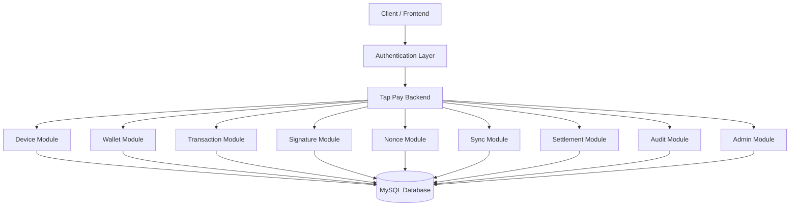

<div align="center">

# 💳 Tap Pay

### Secure • Resilient • Offline-Capable Digital Payment System

A backend-focused fintech system designed to make digital payments **secure, reliable, and resilient even when network connectivity is unavailable**.


> **Pay securely. Keep moving. Sync when connected.**

</div>

---

# 📖 Overview

**Tap Pay** is a secure and resilient digital payment backend built with **Java and Spring Boot**.

The project goes beyond a conventional payment CRUD system by exploring the backend challenges involved in real-world digital payments:

* 🔐 Authentication & authorization
* 📱 Device-level management
* 💰 Wallet operations
* 💳 Transaction processing
* 🔏 Transaction signatures
* 🛡️ Nonce-based replay protection
* 📡 Offline transaction synchronization
* 💸 Settlement processing
* 🧾 Audit logging
* 👨‍💼 Administrative operations

The central idea behind Tap Pay is simple:

> **A temporary loss of connectivity should not automatically mean a broken payment experience.**

---

# 🎯 The Problem

Digital payment systems usually assume that the client can continuously communicate with the payment server.

But real-world environments can introduce:

```text
Poor Network
     │
     ├── Weak Connectivity
     ├── Temporary Outage
     ├── Network Switching
     └── Offline Environment
              │
              ▼
        Payment Failure
```

This creates a reliability problem.

Tap Pay explores a different approach:

```text
                PAYMENT REQUEST
                       │
              ┌────────┴────────┐
              │                 │
           ONLINE            OFFLINE
              │                 │
              ▼                 ▼
        Server Processing   Secure Local
              │             Transaction
              │                 │
              │                 ▼
              │              Queue
              │                 │
              └────────┬────────┘
                       ▼
                    SYNC
                       │
                       ▼
                 VALIDATION
                       │
                       ▼
                  SETTLEMENT
```

---

# ✨ Core Features

### 🔐 Secure Authentication

* JWT-based authentication
* Spring Security integration
* BCrypt password hashing
* Protected backend endpoints
* Role-oriented access control

### 📱 Device Management

* Device registration
* Active device handling
* Device deactivation
* Last-seen tracking
* Device-aware transaction architecture

### 💰 Digital Wallet

* Wallet management
* Balance-oriented operations
* Wallet transaction integration

### 💳 Transaction Processing

* Transaction creation
* Transaction lifecycle management
* Transaction validation
* Transaction attempt tracking
* Transaction status handling

### 🔏 Transaction Security

* Digital transaction signatures
* Nonce generation and validation
* Replay-protection concepts
* Authentication-based authorization

### 📡 Offline Synchronization

* Offline transaction handling
* Pending transaction synchronization
* Server-side validation after reconnection
* Sync-oriented transaction lifecycle

### 💸 Settlement

* Settlement lifecycle
* Transaction-to-settlement flow
* Payment completion processing

### 🧾 Audit Logging

* Transaction-related activity tracking
* User activity records
* Administrative traceability
* Investigation-oriented audit data

### 👨‍💼 Admin Operations

* Administrative transaction operations
* System monitoring foundations
* Audit-oriented backend capabilities

---

# 📊 Project Highlights

| Metric            | Details                     |
| ----------------- | --------------------------- |
| Language          | Java 21                     |
| Framework         | Spring Boot 4.x             |
| Security          | Spring Security + JWT       |
| Database          | MySQL                       |
| Persistence       | Spring Data JPA / Hibernate |
| API               | REST                        |
| Documentation     | Swagger / OpenAPI           |
| Password Security | BCrypt                      |
| Architecture      | Modular Monolith            |
| Payment Model     | Online + Offline Sync       |
| Build Tool        | Maven                       |

---

# 💡 Why Tap Pay?

Most beginner payment projects stop at:

```text
User
 ↓
API
 ↓
Database
```

Tap Pay focuses on the problems that appear **after the basic CRUD layer**.

```text
                  ┌──────────────────┐
                  │     Tap Pay      │
                  └────────┬─────────┘
                           │
       ┌───────────────────┼───────────────────┐
       ▼                   ▼                   ▼
   SECURITY            RESILIENCE          TRACEABILITY
       │                   │                   │
       ▼                   ▼                   ▼
 JWT / BCrypt        Offline Sync        Audit Logs
 Device Security    Nonce Handling       Transaction
 Signatures         Settlement            History
```

This makes Tap Pay a foundation for exploring **real-world fintech backend engineering**.

---

# 🏛 High-Level Architecture



---

# 🧩 Modular Architecture

Tap Pay currently follows a **Modular Monolith** architecture.

Instead of introducing microservices only for the sake of using microservices, the backend keeps related domains inside a single application while maintaining clear module boundaries.

```text
Tap Pay
│
├── Auth
│
├── Device
│
├── Wallet
│
├── Transaction
│
├── Signature
│
├── Nonce
│
├── Settlement
│
├── Sync
│
├── Audit
│
└── Admin
```

### Why Modular Monolith?

A payment system benefits from clear domain boundaries, but distributed infrastructure also introduces:

* Network failures
* Service discovery
* Distributed transactions
* Deployment complexity
* Observability requirements
* Additional debugging overhead

Tap Pay therefore prioritizes:

> **Correct domain separation first. Distribution when scale actually requires it.**

This architecture also keeps the project ready for future service extraction.

---

# 🔄 Payment Flow

## Online Payment

```text
User
 │
 ▼
Authenticate
 │
 ▼
Create Transaction
 │
 ▼
Validate Request
 │
 ▼
Verify Security
 │
 ▼
Process Transaction
 │
 ▼
Settlement
 │
 ▼
Audit
 │
 ▼
Transaction Completed
```

---

# 📡 Offline Payment Flow

The offline workflow is one of the key architectural concepts of Tap Pay.

```text
                   OFFLINE DEVICE
                         │
                         ▼
                  Create Transaction
                         │
                         ▼
                    Generate Nonce
                         │
                         ▼
                  Sign Transaction
                         │
                         ▼
                   Store / Queue
                         │
                  Network Restored
                         │
                         ▼
                       Sync
                         │
                         ▼
                Server Validation
                         │
                 ┌───────┴───────┐
                 │               │
               VALID           INVALID
                 │               │
                 ▼               ▼
             Process          Reject
                 │
                 ▼
             Settlement
                 │
                 ▼
               Audit
```

This provides the foundation for building payment experiences that are more tolerant of temporary connectivity failures.

---

# 🛡️ Security Architecture

Security is treated as a core payment requirement rather than an additional feature.

```text
                  SECURITY LAYER
                       │
       ┌───────────────┼────────────────┐
       ▼               ▼                ▼
 Authentication     Integrity       Replay Protection
       │               │                │
       ▼               ▼                ▼
      JWT           Signature          Nonce
       │               │                │
       └───────────────┼────────────────┘
                       ▼
                 Secure Transaction
```

### JWT Authentication

Provides stateless authentication for protected APIs.

### BCrypt

Passwords are stored using secure password hashing rather than plaintext credentials.

### Digital Signatures

Transaction signatures provide an integrity-oriented security layer.

### Nonce

Nonce handling provides a foundation for preventing replay of previously submitted transaction requests.

### Audit Logs

Important operations can be recorded for traceability and investigation.

---

# 🧱 Core Components

| Module          | Responsibility                      |
| --------------- | ----------------------------------- |
| **Auth**        | Authentication & authorization      |
| **Device**      | Device registration & lifecycle     |
| **Wallet**      | Wallet operations                   |
| **Transaction** | Payment transaction lifecycle       |
| **Signature**   | Transaction integrity               |
| **Nonce**       | Replay protection                   |
| **Settlement**  | Settlement processing               |
| **Sync**        | Offline transaction synchronization |
| **Audit**       | Activity & transaction auditing     |
| **Admin**       | Administrative operations           |

---

# 🗄️ Database Layer

Tap Pay uses **MySQL** as the primary relational database.

The database stores the core payment-domain information required for:

```text
Users
  │
  ├── Devices
  │
  ├── Wallets
  │
  ├── Transactions
  │
  ├── Transaction Attempts
  │
  ├── Signatures
  │
  ├── Nonces
  │
  ├── Settlements
  │
  └── Audit Logs
```

The relational model provides consistency and structured relationships for financial transaction data.

---

# 📁 Project Structure

```text
Tap_Pay
│
├── src
│   ├── main
│   │   ├── java
│   │   │   └── com.example.tap_pay
│   │   │       │
│   │   │       ├── auth
│   │   │       ├── device
│   │   │       ├── wallet
│   │   │       ├── transaction
│   │   │       ├── signature
│   │   │       ├── nonce
│   │   │       ├── settlement
│   │   │       ├── sync
│   │   │       ├── audit
│   │   │       └── admin
│   │   │
│   │   └── resources
│   │       └── application.properties
│   │
│   └── test
│
├── .mvn
├── mvnw
├── mvnw.cmd
├── pom.xml
└── README.md
```

---

# ⚙️ Tech Stack

### Backend

* Java 21
* Spring Boot 4.x
* Spring Web MVC
* Spring Data JPA
* H
